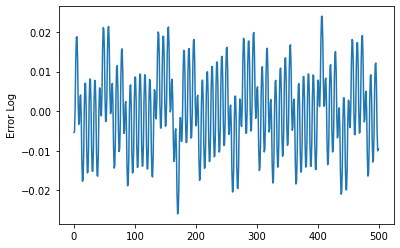
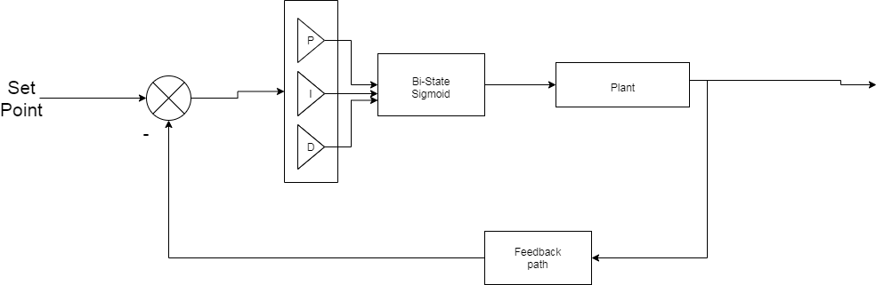

# Balancing a pole on a dynamically moving cart.
<p align="center">
 
</p>

The task of balaning a beam on a cart is a **classic problem in Control Engineering**. The original model deals with a variety of constraints including physical parameters like friction and centre of mass, but for the purpose of simulation, we have to work with certain assumptions. We have **assumed a 1-D motion in which a pole is attached by an un-actuated joint** to a cart, which moves along a frictionless track. The system is controlled by applying a **force of +1 or -1 units to the cart i.e. either right or left**. The pendulum starts upright, and the goal is to prevent it from falling over. **The state space control block is represented by four values: cart position, cart velocity, pole angle, and the velocity of the tip of the pole.** The animation ends when the pole is more than 15 degrees from vertical, or the cart moves more than 2.4 units from the center. Further, a reward of +1 is provided for every timestep that the pole remains upright.

In this repository, I have implemented this problem using various **model based** and **model free** algorithms. The simulation environment used in OpenAI Gym which provides the data for **feedback loop**. It also aids in obaining a rendered animation output. 
Diifferent algorithms used can be summarized below.

 1. **__Gaussian sampling__** - This mehtod initiates the action space with completely random values. It is clearly observant the the average episode length is no longer than 7.
 2. **__Naive-Greedy Brute Force__** - The Naive weight allocation method used a brute force algorithm to get the best weights. The average episode length was found to be around 200. This approach iterates through 100 random weigths which decide the update steps and saves the best obtained weights. It is basically a single layer Neural Network without backpropogation, hence **Naive**.
 3. Further improvements were made by using **__PID controlled On-Off controller__** with fixed weights. The graph obtained is of oscillatory nature as the **control problem is of Regulatory nature**. The control block and the output obtained is shown below. The pole doesnt fall ever !!!! But, it is quite obvious that this is overfitting the model and thus, would not be able to control the pole in dynamic environment                                                        .                                                        
   .
 
 4.  In the fourth trial, I used a simple **__Q-learning model__** that used epsilon greedy based matrix for mitigating through exploration-exploitation trade-offs. 
 5. Finally, I also developed a **__Deep Q-Learning__** network(dqn) based system for balancing the beam, using a Boltzmann policy based rewardning strategy. I made use of the **baselines** library. 

---

## To run the files
  * Clone the repo or download it and extract the files.
  * Import Open AI Gym using the following commmand
  ```cmd
    pip intall gym
  ```
  Gym contains a collection of pre-defined environments, where we can run our algorithms. 
  * It may take up some amount of time while training the network. So it is better to comment out **env.render()** before starting the training. 
  * Gym also allows you to save the final rendered output files using its wrapper functions. The final saved video files, weights and other logs would get saved in your working directory. To work with gym wrappers and save the output files in, 
   ```python
    from gym import wrappers
    env = wrappers.Monitor(env, '..\Desktop\RL\MovieFiles', force = True)
   ```
   
## Debug the environment

The environment that we import from gym have user-friendly APIs. The following section is specific to gym environments.
 * Getiting the largest value possible in state_space
  ```python
     print(env.observation_space.high)
  ```
 * Getting the lowest value possible in state_space
  ```python
     print(env.observation_space.low)
  ```
 * Getting the number of actions space possible
   ```python
     print(env.action_space.n)
   ```
 * Viewing the animation 
  ```python
     env.render()
  ```
  
